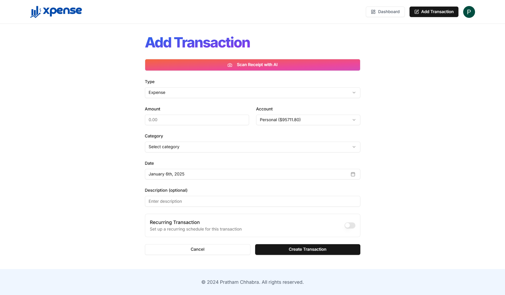

# Xpense - Your Smart Finance Manager

Xpense is an intelligent finance management web application designed to simplify and enhance the way you track and analyze your expenses. With seamless AI integration, it helps users manage transactions, visualize data, and gain insights into their financial habits. Whether you're looking to track your daily spending, generate monthly reports, or set a budget, Xpense has you covered!

## Features

### User Authentication

- Secure user authentication using **Clerk**.
- Protection against bots and attacks with **Arcjet**.

### Account Management

- Add multiple accounts to categorize your transactions effectively.

### Transaction Tracking

- **Manual Entry**: Add transactions manually with ease.
- **AI Receipt Scanner**: Scan your receipts with one click to automatically add transactions.

### Advanced Sorting and Filtering

- Sort transactions by:
  - **Type** (Income/Expense)
  - **Category**
  - **Date**
  - **Other custom criteria**

### Data Visualization

- **Interactive Graphs**:
  - Visualize income and expenses over time.
  - Understand spending patterns through detailed charts.
- **Pie Chart**:
  - See your monthly budget allocation at a glance on the dashboard.

### Monthly Reports

- **Summary**: Get a detailed monthly report of all transactions.
- **AI Insights**: Personalized financial insights to help you make better decisions.

### User-Friendly Interface

- Intuitive and interactive UI to provide the best user experience.

## Tech Stack

### Full Stack Framework

- **Next.js** with **TypeScript**: Used for both frontend (interactive UI) and backend (API routes, server-side logic).
- **Tailwind CSS**: For a responsive and visually appealing design.

### Backend

- **Next.js API Routes**: Simplifies server-side logic and integrations.
- **Prisma**: Elegant and type-safe database ORM.
- **PostgreSQL**: Robust and scalable relational database.

### Libraries and Tools

- **Zod**: Schema validation for enhanced type safety.
- **Resend**: Seamless email integration.
- **Inngest**: Workflow automation for background processes.
- **Arcjet**: Advanced bot protection and security.

## Installation

1. Clone the repository:

   ```bash
   git clone https://github.com/your-username/xpense.git
   cd xpense
   ```

2. Install dependencies:

   ```bash
   npm install
   ```

3. Configure environment variables:

   - Create a `.env` file in the root directory.
   - Add the required keys for database, API, and third-party services.

4. Run the development server:

   ```bash
   npm run dev
   ```

5. Open the app in your browser:
   ```
   http://localhost:3000
   ```

## Contributing

We welcome contributions to improve Xpense! If you'd like to contribute:

1. Fork the repository.
2. Create a new branch for your feature or bugfix.
3. Submit a pull request with a detailed description of your changes.

## License

This project is licensed under the MIT License. See the [LICENSE](LICENSE) file for details.

## Acknowledgments

- The amazing open-source tools and libraries that made this project possible.

---

### Screenshots



