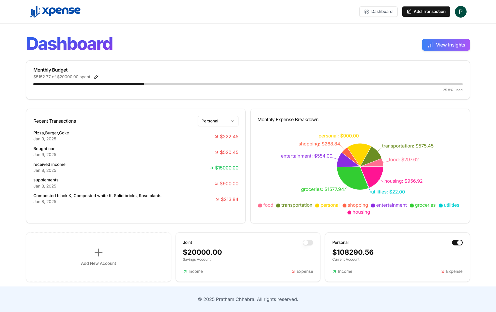

# Xpense - AI-Powered Financial Manager

Xpense is an intelligent, AI-driven financial management web application that simplifies expense tracking and budgeting. With advanced analytics, interactive data visualizations, and AI-powered insights, Xpense helps users stay on top of their finances with ease. Whether you want to manage transactions, generate reports, or set budgets, Xpense is your ultimate finance companion.

---

## Features

### 🌟 Core Features

- **Secure Authentication**: Powered by **Clerk** for seamless signup and login.
- **Transaction Management**:
  - **Manual Entry**: Add transactions manually.
  - **AI Receipt Scanner**: Automatically log transactions by scanning receipts.
- **Account Management**: Support for multiple accounts to organize your finances better.
- **Sorting & Filtering**: Sort transactions by category, date, or amount and search with ease.
- **Insights**: Personalized AI-generated monthly budgets and financial insights.

### 📊 Data Visualization

- **Interactive Charts**:
  - View income and expenses over the past six months.
  - Analyze spending trends using bar graphs and pie charts.
- **Savings Simulator**:
  - Simulate potential savings by adjusting spending in specific categories.
  - See real-time impacts on your overall budget.

### 🔔 Alerts & Reports

- **Budget Alerts**: Receive notifications when your spending approaches budget limits.
- **Monthly Summaries**: Detailed reports sent directly to your inbox.
- **Recommendations**: Get actionable insights to optimize your finances.

### 📱 Responsive Design

- Fully optimized for desktop and mobile devices, providing a seamless experience across all platforms.

### 🔒 Security & Automation

- **Bot Protection**: Ensured by **Arcjet**.
- **Automated Tasks**: Background processes managed using **Inngest**.
- **Email Notifications**: Handled seamlessly via **Resend**.

---

## Tech Stack

- **Frontend**: Next.js with TypeScript and Tailwind CSS
- **Backend**: Prisma ORM and PostgreSQL
- **Libraries**: Zod, Inngest, Resend, Clerk, Arcjet

---

## Installation

1. Clone the repository:

   ```bash
   git clone https://github.com/your-username/xpense.git
   cd xpense
   ```

2. Install dependencies:

   ```bash
   npm install
   ```

3. Configure environment variables:

   - Create a `.env` file in the root directory.
   - Add the required keys for database, API, and third-party services.

4. Run the development server:

   ```bash
   npm run dev
   ```

5. Open the app in your browser:
   ```
   http://localhost:3000
   ```

---

## Contributing

We welcome contributions to improve Xpense! If you'd like to contribute:

1. Fork the repository.
2. Create a new branch for your feature or bugfix.
3. Submit a pull request with a detailed description of your changes.

## License

This project is licensed under the MIT License. See the [LICENSE](LICENSE) file for details.

## Acknowledgments

- The amazing open-source tools and libraries that made this project possible.

---

### Screenshots





